<!--TITLEPAGE-->
# Лабораторная работа №1

**Ульяновский государственный технический университет**

Факультет информационных систем и технологий

Кафедра «Информационные системы»

**Дисциплина:** Алгоритмы и структуры данных

**Тема:** Анализ данных, линейная регрессия и деревья решений

**Выполнил студент группы** ___________ ___________________________

**Проверил:** ___________________________

Ульяновск, 2026

\pagebreak

## 1. Задание на лабораторную работу

**Цель работы:** получить навыки по анализу данных, использованию линейной
регрессии и деревьев решений. Язык выполнения — Python.

**Основное задание (датасет Iris):**

1. Проанализировать датасет `https://raw.githubusercontent.com/uiuc-cse/data-fa14/gh-pages/data/iris.csv`:
   определить признаки объекта, баланс датасета (соотношение объектов между
   классами), определить метки и понять, как разделяются объекты.
2. Вручную сформировать правила вида «ЕСЛИ sepal length > 3 cm AND sepal width < 4.5 cm ТО Versicolor».
3. Сформировать прогноз — построить соответствие между объектом и классом
   автоматизированно через сформированные правила, сохранить в CSV-файл.
4. Обучить модель «дерево решений», попробовать разные значения глубины
   (3, 5, 7, …). Сохранить в CSV-файл.
5. Обучить модель линейной регрессии, попробовать разные значения количества
   итераций обучения (10, …, 100). Сохранить в CSV-файл.
6. Построить графики: потерь при обучении; accuracy и precision по итерациям;
   L2-нормы вектора весов ‖W‖; L2-нормы изменения весов ‖ΔW‖.

**Задание по варианту (на защиту лабораторной работы №1):**

* **Wine Dataset** — мультиклассовая классификация трёх сортов вина по 13
  химическим показателям (178 объектов). Требуется: найти признаки, сильнее
  всего связанные с классом; сформулировать ручные правила по 1–2 важнейшим
  признакам и оценить их точность; обучить дерево решений глубины 3, 5, 7, 10,
  сравнить точность и вывести правила дерева; сравнить модели и ответить, что
  сложнее разделить — три сорта вина или три вида ирисов.
* **Palmer Penguins Dataset** — классификация трёх видов пингвинов по
  измерениям клюва, ласт и массы тела (344 объекта, есть пропуски). Требуется:
  построить попарные графики признаков, обработать пропуски, сформулировать
  ручные правила, обучить дерево решений разной глубины и объяснить, чем этот
  датасет сложнее Iris.

**Требования к сдаче:** единый стиль форматирования кода, разбиение кода на
классы и методы, проверка работоспособности на различных наборах входных данных.

\pagebreak

## 2. Используемые алгоритмы и структуры данных

### 2.1. Структуры данных

| Структура | Где используется | Обоснование выбора |
|---|---|---|
| `numpy.ndarray` | матрицы признаков, веса модели, градиенты | непрерывный блок памяти, доступ по индексу за O(1), векторизованные операции выполняются в скомпилированном коде |
| `pandas.DataFrame` | исходные данные, таблицы результатов | удобные именованные столбцы, группировки, чтение и запись CSV |
| `list[dict]` | история обучения (по одной записи на итерацию) | дешёвое добавление в конец за O(1), затем однократное преобразование в `DataFrame` |
| `dict` | сопоставление «имя класса → индекс», параметры экспериментов | доступ по ключу за O(1) в среднем |
| `dataclass` (`Dataset`, `Rule`, `Condition`, `TreeResult`) | абстрактные типы данных предметной области | АТД описывает *что* хранится и какие операции допустимы, скрывая представление |
| упорядоченный список правил | классификатор «если–то» | правила применяются по порядку, первое сработавшее определяет класс |
| дерево (внутри `DecisionTreeClassifier`) | дерево решений | путь от корня к листу — это готовое интерпретируемое правило |

Разделение на **АТД** и **структуру данных** в работе видно на примере класса
`Dataset`: снаружи это «набор размеченных объектов» с операциями
`class_balance()`, `y_encoded()`, а внутри — `DataFrame` и `Series`.

### 2.2. Классификация по правилам, заданным вручную

Правило — конъюнкция элементарных условий «признак ⊗ порог». Пороги выбраны по
результатам разведочного анализа: берутся признаки с наибольшим корреляционным
отношением η², и по гистограммам/диаграммам рассеяния находится значение,
разделяющее классы.

Классификация объекта — линейный проход по списку правил до первого
сработавшего: **O(r · c)**, где r — число правил, c — число условий в правиле.
Обучения нет вообще, поэтому это самый быстрый и самый интерпретируемый
из рассмотренных методов.

### 2.3. Дерево решений

Используется `sklearn.tree.DecisionTreeClassifier` (критерий Джини). Алгоритм
CART жадно выбирает признак и порог, максимизирующие уменьшение неоднородности:

Gini(S) = 1 − Σ pᵢ², где pᵢ — доля объектов класса i в узле S.

* сложность обучения: **O(n · m · log n)** (n — объектов, m — признаков);
* сложность классификации одного объекта: **O(h)**, h — глубина дерева;
* память: O(числа узлов).

Параметр `max_depth` напрямую управляет компромиссом «недообучение —
переобучение»: чем глубже дерево, тем точнее оно на обучающей выборке и тем
выше риск запомнить шум.

### 2.4. Линейная и softmax-регрессия (реализованы вручную)

Обе модели линейны по параметрам: z = X·W, где W имеет размер (m + 1) × k
(последняя строка — свободный член). Различаются функцией потерь:

* **линейная регрессия (MSE)** на one-hot кодированные метки:
  L = (1/n) Σ ‖z − Y‖²; класс = argmax z;
* **softmax-регрессия (log-loss)**: p = softmax(z),
  L = −(1/n) Σ Σ Y·ln p; класс = argmax p.

Обучение — пакетный градиентный спуск: на каждой итерации
W ← W − η · ∇L, где ∇L = c · Xᵀ(выход − Y) / n (c = 2 для MSE, c = 1 для
softmax). Признаки предварительно стандартизуются (z = (x − μ)/σ), иначе
признаки с большим масштабом (например, `proline` в Wine) подавляют остальные,
и спуск расходится.

* сложность обучения: **O(iterations · n · m · k)**;
* сложность предсказания: **O(m · k)** на объект;
* память: O(n · m) на данные и O(m · k) на веса.

Реализация softmax численно устойчива: перед экспонированием из каждой строки
вычитается её максимум.

### 2.5. Метрики и индикаторы сходимости

* **Accuracy** = доля верных ответов;
* **Precision** класса i = TPᵢ / (TPᵢ + FPᵢ), в отчёте используется
  macro-усреднение по классам;
* **‖W‖₂** — «размер» модели; стабилизация нормы означает, что обучение
  завершается, резкий рост — расходимость (взрыв градиентов);
* **‖ΔW‖₂** — длина шага в пространстве параметров; стремление к нулю —
  признак сходимости, именно по этой величине удобно настраивать early stopping.

Все метрики реализованы вручную на NumPy и в тестах сверены с `scikit-learn`.

\pagebreak

## 3. Сжатый исходный код

Полный код находится в каталоге `code/`. Ниже приведены ключевые фрагменты, вставленные в отчёт напрямую из модулей проекта.

### 3.1. Структура проекта

```text
AISD/
├── code/
│   ├── main.py                 # точка входа, разбор аргументов командной строки
│   ├── data/                   # локальные копии датасетов (работа без интернета)
│   ├── results/                # CSV-таблицы и текстовые отчёты (результат прогона)
│   ├── src/
│   │   ├── datasets.py         # Dataset, DatasetLoader
│   │   ├── analysis.py         # DatasetAnalyzer: разведочный анализ
│   │   ├── rules.py            # Condition, Rule, RuleBasedClassifier, RuleLibrary
│   │   ├── linear_model.py     # StandardScaler, GradientDescentClassifier
│   │   ├── tree_model.py       # DecisionTreeExperiment
│   │   ├── metrics.py          # ClassificationMetrics
│   │   ├── plots.py            # PlotBuilder
│   │   ├── benchmark.py        # Benchmark, BenchmarkTable
│   │   └── pipeline.py         # Lab1Pipeline: сценарий работы целиком
│   └── tests/test_lab1.py      # 36 модульных тестов
├── report/                     # этот отчёт, графики и скрипт его сборки
├── requirements.txt
└── run.bat, run.sh             # запуск всей работы одной командой
```

### 3.2. Правило как структура данных

```python
@dataclass
class Rule:
    """Правило: конъюнкция условий и предсказываемый класс."""

    conditions: list[Condition]
    target: str
    comment: str = ""
    _fired: int = field(default=0, init=False, repr=False)

    def mask(self, X: pd.DataFrame) -> np.ndarray:
        """Булева маска объектов, для которых выполнены все условия."""
        result = np.ones(len(X), dtype=bool)
        for condition in self.conditions:
            result &= condition.evaluate(X[condition.feature])
        return result

    def __str__(self) -> str:
        body = " AND ".join(str(c) for c in self.conditions)
        text = f"ЕСЛИ {body} ТО {self.target}"
        return f"{text}   # {self.comment}" if self.comment else text
```

### 3.3. Применение правил (первое сработавшее правило определяет класс)

```python
    def predict(self, X: pd.DataFrame) -> np.ndarray:
        """Применяет правила по порядку; первое сработавшее задаёт класс."""
        predictions = np.full(len(X), self.default_class, dtype=object)
        assigned = np.zeros(len(X), dtype=bool)
        for rule in self.rules:
            mask = rule.mask(X) & ~assigned
            rule._fired = int(mask.sum())
            predictions[mask] = rule.target
            assigned |= mask
        return predictions.astype(str)
```

### 3.4. Обучение линейной модели градиентным спуском

```python
    def fit(
        self,
        X_train: np.ndarray,
        y_train: np.ndarray,
        X_test: np.ndarray | None = None,
        y_test: np.ndarray | None = None,
    ) -> "GradientDescentClassifier":
        """Обучает модель и заполняет историю обучения по итерациям."""
        Xb = self._prepare(X_train, fit=True)
        Y = self._one_hot(y_train)
        y_train = np.asarray(y_train, dtype=int)
        n_samples = Xb.shape[0]

        rng = np.random.default_rng(self.random_state)
        self.W = rng.normal(scale=0.01, size=(Xb.shape[1], self.n_classes))
        self.history = []

        has_test = X_test is not None and y_test is not None
        if has_test:
            Xb_test = self._prepare(X_test, fit=False)
            Y_test = self._one_hot(y_test)
            y_test = np.asarray(y_test, dtype=int)

        for iteration in range(1, self.n_iterations + 1):
            output = self._forward(Xb)

            # Градиент по форме одинаков для MSE (с множителем 2) и softmax.
            error = output - Y
            scale = 2.0 if self.loss == "mse" else 1.0
            grad = scale * (Xb.T @ error) / n_samples
            if self.l2 > 0:
                grad[:-1] += 2 * self.l2 * self.W[:-1]

            step = self.learning_rate * grad
            self.W -= step

            # --- запись истории обучения после шага ---
            output = self._forward(Xb)
            y_pred = output.argmax(axis=1)
            record: dict[str, float] = {
                "iteration": iteration,
                "train_loss": self._loss_value(output, Y),
                "train_accuracy": self.metrics.accuracy(y_train, y_pred),
                "train_precision_macro": self.metrics.macro_precision(y_train, y_pred),
                "weight_norm_l2": float(np.linalg.norm(self.W)),
                "weight_update_norm_l2": float(np.linalg.norm(step)),
            }
            if has_test:
                out_test = self._forward(Xb_test)
                y_pred_test = out_test.argmax(axis=1)
                record["test_loss"] = self._loss_value(out_test, Y_test)
                record["test_accuracy"] = self.metrics.accuracy(y_test, y_pred_test)
                record["test_precision_macro"] = self.metrics.macro_precision(y_test, y_pred_test)
                for name, value in zip(
                    self.class_names, self.metrics.precision_per_class(y_test, y_pred_test)
                ):
                    record["test_precision_" + name] = float(value)
            self.history.append(record)

        return self
```

### 3.5. Вычисление precision по классам

```python
    def precision_per_class(self, y_true: np.ndarray, y_pred: np.ndarray) -> np.ndarray:
        """Точность по каждому классу: TP / (TP + FP)."""
        cm = self.confusion_matrix(y_true, y_pred)
        predicted = cm.sum(axis=0)          # сколько раз класс был предсказан
        true_positive = np.diag(cm)
        with np.errstate(divide="ignore", invalid="ignore"):
            precision = np.where(predicted > 0, true_positive / np.maximum(predicted, 1), 0.0)
        return precision.astype(float)
```

### 3.6. Перебор глубины дерева решений

```python
    def run(
        self,
        X_train: np.ndarray,
        y_train: np.ndarray,
        X_test: np.ndarray,
        y_test: np.ndarray,
    ) -> list[TreeResult]:
        """Обучает по дереву на каждую глубину из self.depths."""
        self.results = []
        for depth in self.depths:
            model = DecisionTreeClassifier(
                max_depth=depth,
                criterion=self.criterion,
                random_state=self.random_state,
            )
            with Benchmark() as bench:
                model.fit(X_train, y_train)
            result = TreeResult(
                max_depth=depth,
                model=model,
                metrics_train=self.metrics.summary(y_train, model.predict(X_train)),
                metrics_test=self.metrics.summary(y_test, model.predict(X_test)),
                rules_text=export_text(
                    model, feature_names=self.feature_names, class_names=self.class_names
                ),
                fit_seconds=bench.seconds,
                peak_memory_kb=bench.peak_kb,
            )
            self.results.append(result)
        return self.results
```

\pagebreak
## 4. Результаты: датасет Iris

### 4.1. Анализ датасета

| параметр | значение |
|---|---|
| Название | Iris (ирисы Фишера) |
| Источник | https://raw.githubusercontent.com/uiuc-cse/data-fa14/gh-pages/data/iris.csv |
| Число объектов | 150 |
| Число признаков | 4 |
| Число классов | 3 |
| Признаки | sepal_length, sepal_width, petal_length, petal_width |
| Классы (метки) | setosa, versicolor, virginica |
| Пропусков в признаках | 0 |
| Тип признаков | вещественные (количественные) |
| Примечание | Пропусков нет, датасет идеально сбалансирован (50/50/50). |

**Баланс классов.**

| class | count | share_% | imbalance_ratio_max_min |
|---|---|---|---|
| setosa | 50 | 33.33 | 1.0 |
| versicolor | 50 | 33.33 | 1.0 |
| virginica | 50 | 33.33 | 1.0 |

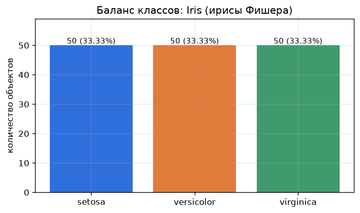

*Рисунок 4.1 — баланс классов*

**Информативность признаков.** Величина η² показывает, какая доля дисперсии признака объясняется принадлежностью к классу: чем ближе к 1, тем лучше признак разделяет классы.

| feature | eta_squared | abs_corr_with_label | min | mean | max |
|---|---|---|---|---|---|
| petal_length | 0.9413 | 0.949 | 1.0 | 3.759 | 6.9 |
| petal_width | 0.9288 | 0.9565 | 0.1 | 1.199 | 2.5 |
| sepal_length | 0.6187 | 0.7826 | 4.3 | 5.843 | 7.9 |
| sepal_width | 0.3919 | 0.4194 | 2.0 | 3.054 | 4.4 |

Наиболее информативные признаки: **petal_length** (η² = 0.9413), **petal_width** (η² = 0.9288), **sepal_length** (η² = 0.6187).

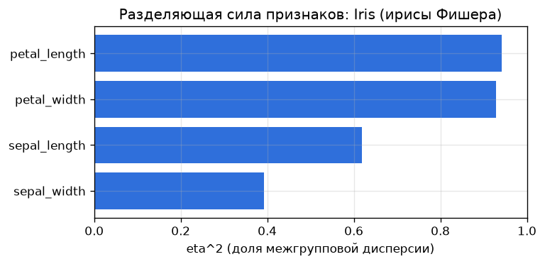

*Рисунок 4.2 — разделяющая сила признаков*

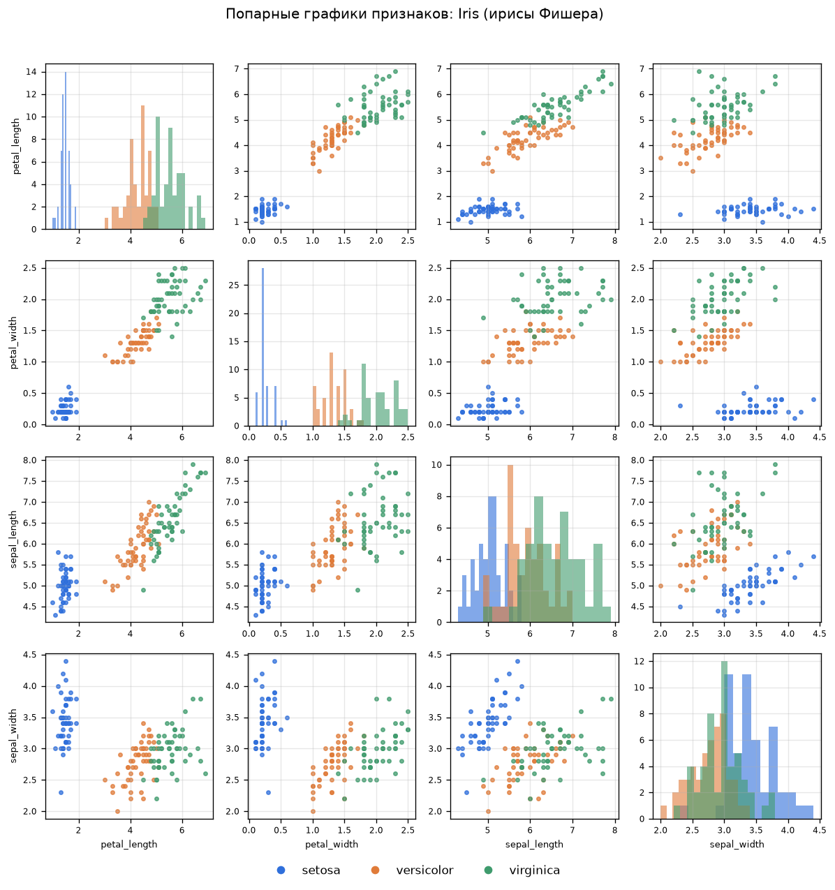

*Рисунок 4.3 — попарные графики признаков*

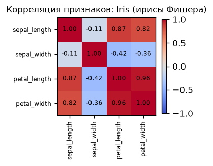

*Рисунок 4.4 — корреляция признаков*

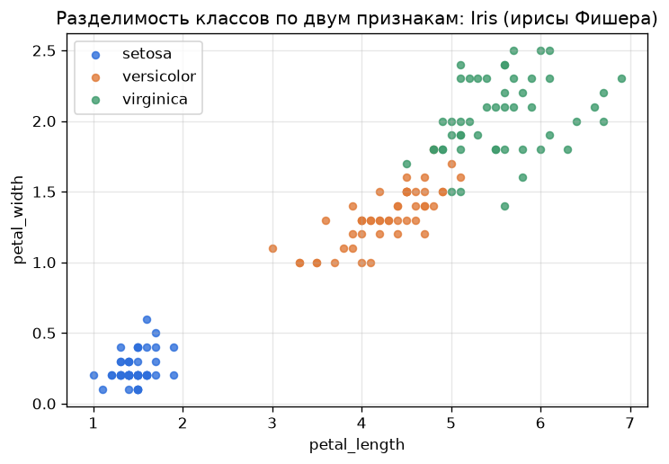

*Рисунок 4.5 — разделимость классов по двум лучшим признакам*

### 4.2. Правила, сформулированные вручную

```text
1. ЕСЛИ petal_length < 2.45 ТО setosa   # setosa линейно отделима по длине лепестка
2. ЕСЛИ petal_width < 1.75 AND petal_length < 4.95 ТО versicolor   # узкий и короткий лепесток
3. ИНАЧЕ ТО virginica
```

Покрытие и точность каждого правила:

| rule | predicted_class | covered | correct | rule_precision |
|---|---|---|---|---|
| ЕСЛИ petal_length < 2.45 ТО setosa | setosa | 50 | 50 | 1.0 |
| ЕСЛИ petal_width < 1.75 AND petal_length < 4.95 ТО versicolor | versicolor | 48 | 47 | 0.9792 |
| ИНАЧЕ (правило по умолчанию) ТО virginica | virginica | 52 | 49 | 0.9423 |

Точность набора правил: **0.9733** на всех 150 объектах и **0.9556** на тестовой выборке. Прогноз сохранён в файл `code/results/iris/10_predictions_manual_rules.csv` (строка = объект, столбцы = признаки, истинный класс, предсказанный класс, признак совпадения).

### 4.3. Дерево решений

| max_depth | train_accuracy | test_accuracy | train_precision_macro | test_precision_macro | real_depth | leaves | nodes | fit_seconds | peak_memory_kb |
|---|---|---|---|---|---|---|---|---|---|
| 3 | 0.981 | 0.9778 | 0.981 | 0.9792 | 3 | 5 | 9 | 0.0025 | 28.34 |
| 5 | 1.0 | 0.9333 | 1.0 | 0.9444 | 5 | 8 | 15 | 0.001941 | 20.98 |
| 7 | 1.0 | 0.9333 | 1.0 | 0.9444 | 5 | 8 | 15 | 0.002163 | 21.08 |
| 10 | 1.0 | 0.9333 | 1.0 | 0.9444 | 5 | 8 | 15 | 0.002275 | 21.08 |
| без ограничения | 1.0 | 0.9333 | 1.0 | 0.9444 | 5 | 8 | 15 | 0.00216 | 21.23 |

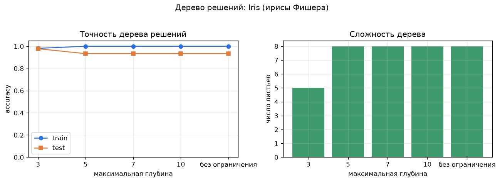

*Рисунок 4.6 — точность и сложность дерева в зависимости от глубины*

Правила лучшего дерева (глубина 3):

```text
|--- petal_length <= 2.45
|   |--- class: setosa
|--- petal_length >  2.45
|   |--- petal_width <= 1.55
|   |   |--- petal_length <= 4.95
|   |   |   |--- class: versicolor
|   |   |--- petal_length >  4.95
|   |   |   |--- class: virginica
|   |--- petal_width >  1.55
|   |   |--- petal_width <= 1.70
|   |   |   |--- class: versicolor
|   |   |--- petal_width >  1.70
|   |   |   |--- class: virginica
```

### 4.4. Линейная и softmax-регрессия: влияние числа итераций

| model | n_iterations | train_loss | train_accuracy | test_accuracy | test_precision_macro | weight_norm_l2 | weight_update_norm_l2 |
|---|---|---|---|---|---|---|---|
| Линейная регрессия (MSE) | 10 | 0.2802 | 0.8571 | 0.7556 | 0.7803 | 0.6644 | 0.0194 |
| Линейная регрессия (MSE) | 20 | 0.2689 | 0.8762 | 0.7556 | 0.7667 | 0.7332 | 0.0075 |
| Линейная регрессия (MSE) | 30 | 0.2648 | 0.8857 | 0.7333 | 0.7384 | 0.757 | 0.0057 |
| Линейная регрессия (MSE) | 40 | 0.2624 | 0.8857 | 0.7333 | 0.7384 | 0.7748 | 0.0045 |
| Линейная регрессия (MSE) | 50 | 0.2608 | 0.8857 | 0.7556 | 0.7593 | 0.7903 | 0.0036 |
| Линейная регрессия (MSE) | 60 | 0.2597 | 0.8857 | 0.7556 | 0.7593 | 0.8038 | 0.003 |
| Линейная регрессия (MSE) | 70 | 0.259 | 0.8857 | 0.8 | 0.8056 | 0.8155 | 0.0026 |
| Линейная регрессия (MSE) | 80 | 0.2584 | 0.8857 | 0.8 | 0.8056 | 0.8256 | 0.0023 |
| Линейная регрессия (MSE) | 90 | 0.2579 | 0.8857 | 0.8 | 0.8056 | 0.8346 | 0.0021 |
| Линейная регрессия (MSE) | 100 | 0.2575 | 0.8857 | 0.8 | 0.8056 | 0.8427 | 0.0019 |
| Softmax-регрессия (log-loss) | 10 | 0.3688 | 0.9048 | 0.8222 | 0.8341 | 1.6739 | 0.077 |
| Softmax-регрессия (log-loss) | 20 | 0.3004 | 0.9238 | 0.8222 | 0.825 | 2.2211 | 0.0492 |
| Softmax-регрессия (log-loss) | 30 | 0.263 | 0.9333 | 0.8444 | 0.8452 | 2.6141 | 0.0396 |
| Softmax-регрессия (log-loss) | 40 | 0.2366 | 0.9524 | 0.8444 | 0.8452 | 2.9398 | 0.0342 |
| Softmax-регрессия (log-loss) | 50 | 0.2162 | 0.9524 | 0.8444 | 0.8452 | 3.226 | 0.0304 |
| Softmax-регрессия (log-loss) | 60 | 0.1998 | 0.9619 | 0.8667 | 0.8667 | 3.4844 | 0.0275 |
| Softmax-регрессия (log-loss) | 70 | 0.1862 | 0.9714 | 0.8667 | 0.8667 | 3.721 | 0.0251 |
| Softmax-регрессия (log-loss) | 80 | 0.1748 | 0.981 | 0.8667 | 0.8667 | 3.9398 | 0.0231 |
| Softmax-регрессия (log-loss) | 90 | 0.165 | 0.981 | 0.8667 | 0.8667 | 4.1434 | 0.0213 |
| Softmax-регрессия (log-loss) | 100 | 0.1567 | 0.981 | 0.8667 | 0.8667 | 4.3339 | 0.0199 |

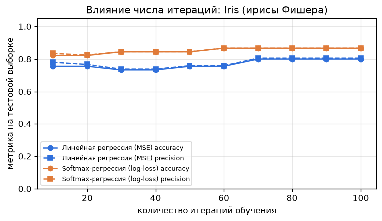

*Рисунок 4.7 — качество в зависимости от числа итераций обучения*

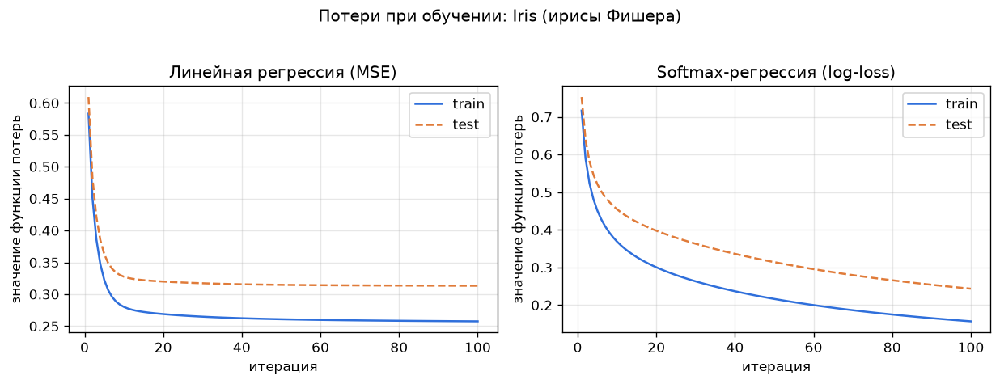

*Рисунок 4.8 — потери при обучении*

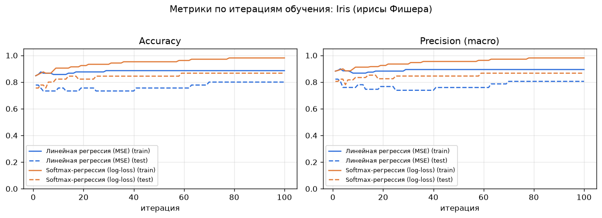

*Рисунок 4.9 — accuracy и precision по итерациям*

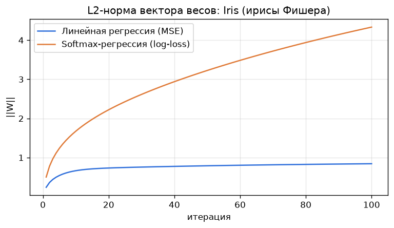

*Рисунок 4.10 — L2-норма вектора весов ‖W‖*

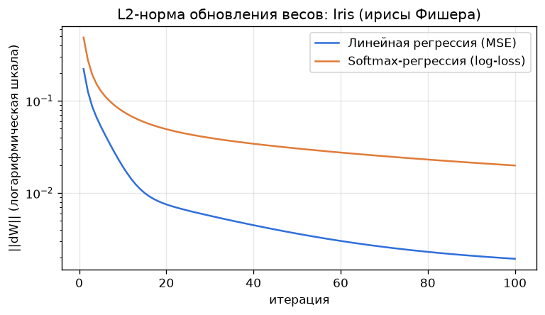

*Рисунок 4.11 — L2-норма изменения весов ‖ΔW‖ (логарифмическая шкала)*

### 4.5. Сравнение моделей

| model | params | test_accuracy | test_precision_macro | test_recall_macro | test_f1_macro | fit_time_ms | peak_memory_kb | precision_setosa | precision_versicolor | precision_virginica |
|---|---|---|---|---|---|---|---|---|---|---|
| Ручные правила | 3 правил | 0.9556 | 0.9556 | 0.9556 | 0.9556 | 0.0 | 11.24 | 1.0 | 0.9333 | 0.9333 |
| Дерево решений (глубина 3) | max_depth=3, листьев=5 | 0.9778 | 0.9792 | 0.9778 | 0.9785 | 2.5 | 28.34 | 1.0 | 1.0 | 0.9375 |
| Линейная регрессия (MSE) | lr=0.1, iterations=100 | 0.8 | 0.8056 | 0.8 | 0.8028 | 60.139 | 112.75 | 1.0 | 0.75 | 0.6667 |
| Softmax-регрессия (log-loss) | lr=0.5, iterations=100 | 0.8667 | 0.8667 | 0.8667 | 0.8667 | 68.076 | 122.67 | 1.0 | 0.8 | 0.8 |

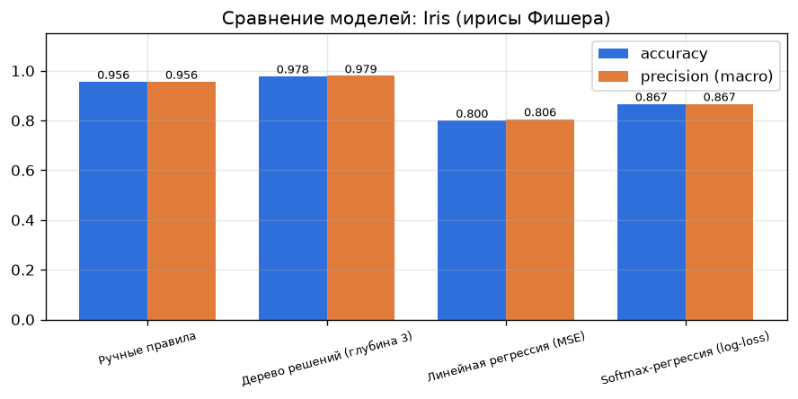

*Рисунок 4.12 — сравнение моделей*

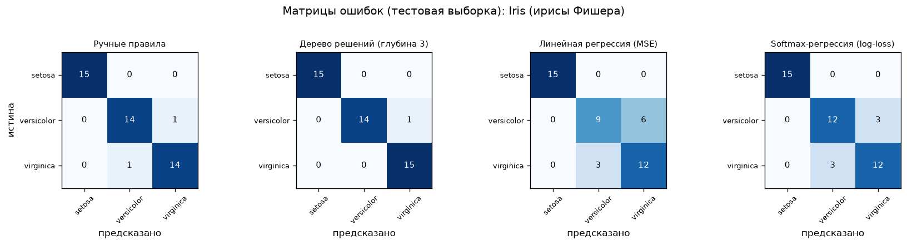

*Рисунок 4.13 — матрицы ошибок*

**Выводы по Iris.**

* Класс *setosa* линейно отделим от остальных по длине лепестка: одно условие
  `petal_length < 2.45` даёт precision 1.00. Классы *versicolor* и *virginica*
  частично перекрываются — именно на их границе ошибаются все модели.
* Три правила, записанные от руки, дают accuracy 0.9733 на всём датасете —
  результат, сопоставимый с обученными моделями. Это прямое следствие того,
  что данные хорошо разделимы по двум признакам.
* Дерево глубины 3 даёт лучшую точность на тесте (0.9778),
  а более глубокие деревья доходят до accuracy 1.00 на обучающей выборке, но на
  тесте показывают всего 0.9333 — это наглядное
  **переобучение**: дерево запоминает шум вместо закономерности.
* Линейные модели за 100 итераций не успевают полностью сойтись: ‖ΔW‖ убывает с
  0.4870 до
  0.01988, но ещё не равна нулю, а ‖W‖
  продолжает монотонно расти. Softmax-регрессия заметно лучше линейной регрессии
  на MSE, потому что MSE штрафует «слишком уверенные» правильные ответы и плохо
  подходит для задачи классификации.

\pagebreak
## 5. Задание на защиту №1: датасет Wine

### 5.1. Анализ датасета

| параметр | значение |
|---|---|
| Название | Wine (классификация сортов вина) |
| Источник | sklearn.datasets.load_wine (оригинал: UCI Wine Data Set) |
| Число объектов | 178 |
| Число признаков | 13 |
| Число классов | 3 |
| Признаки | alcohol, malic_acid, ash, alcalinity_of_ash, magnesium, total_phenols, flavanoids, nonflavanoid_phenols, proanthocyanins, color_intensity, hue, od280/od315_of_diluted_wines, proline |
| Классы (метки) | class_0, class_1, class_2 |
| Пропусков в признаках | 0 |
| Тип признаков | вещественные (количественные) |
| Примечание | Пропусков нет, классы слегка несбалансированы (59/71/48). |
| Примечание | Признаки имеют разный масштаб (от 0.13 до 1680) -> нужна стандартизация. |

**Баланс классов.**

| class | count | share_% | imbalance_ratio_max_min |
|---|---|---|---|
| class_0 | 59 | 33.15 | 1.48 |
| class_1 | 71 | 39.89 | 1.48 |
| class_2 | 48 | 26.97 | 1.48 |

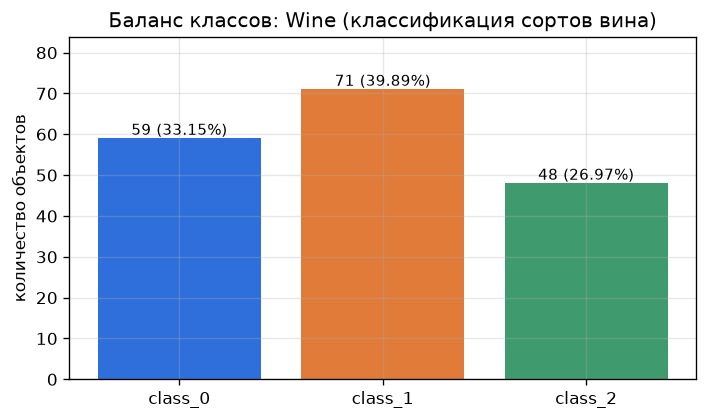

*Рисунок 5.1 — баланс классов*

**Информативность признаков.** Величина η² показывает, какая доля дисперсии признака объясняется принадлежностью к классу: чем ближе к 1, тем лучше признак разделяет классы.

| feature | eta_squared | abs_corr_with_label | min | mean | max |
|---|---|---|---|---|---|
| flavanoids | 0.7278 | 0.8475 | 0.34 | 2.029 | 5.08 |
| proline | 0.7038 | 0.6337 | 278.0 | 746.893 | 1680.0 |
| od280/od315_of_diluted_wines | 0.6847 | 0.7882 | 1.27 | 2.612 | 4.0 |
| alcohol | 0.6069 | 0.3282 | 11.03 | 13.001 | 14.83 |
| color_intensity | 0.5797 | 0.2657 | 1.28 | 5.058 | 13.0 |
| hue | 0.5366 | 0.6174 | 0.48 | 0.957 | 1.71 |
| total_phenols | 0.5172 | 0.7192 | 0.98 | 2.295 | 3.88 |
| malic_acid | 0.2969 | 0.4378 | 0.74 | 2.336 | 5.8 |
| alcalinity_of_ash | 0.2902 | 0.5179 | 10.6 | 19.495 | 30.0 |
| proanthocyanins | 0.257 | 0.4991 | 0.41 | 1.591 | 3.58 |
| nonflavanoid_phenols | 0.2396 | 0.4891 | 0.13 | 0.362 | 0.66 |
| ash | 0.1321 | 0.0496 | 1.36 | 2.367 | 3.23 |
| magnesium | 0.1244 | 0.2092 | 70.0 | 99.742 | 162.0 |

Наиболее информативные признаки: **flavanoids** (η² = 0.7278), **proline** (η² = 0.7038), **od280/od315_of_diluted_wines** (η² = 0.6847).

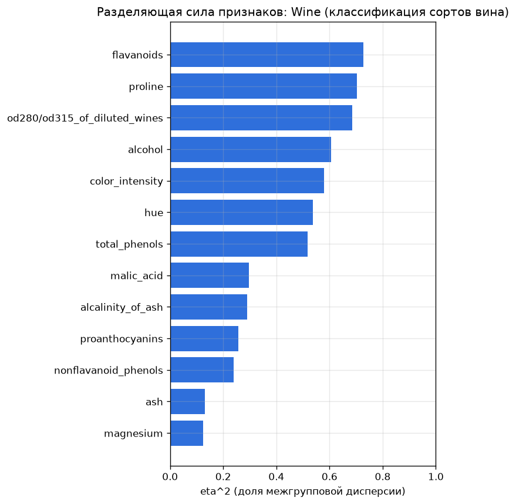

*Рисунок 5.2 — разделяющая сила признаков*

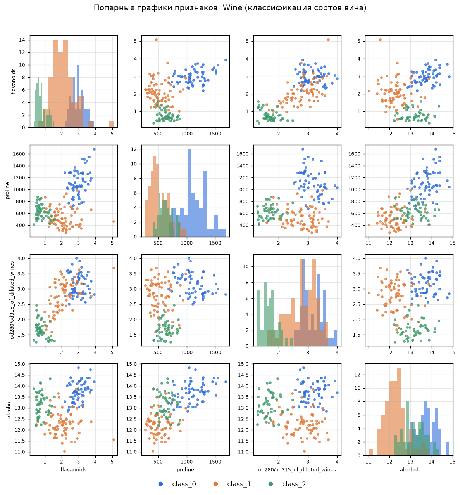

*Рисунок 5.3 — попарные графики признаков*

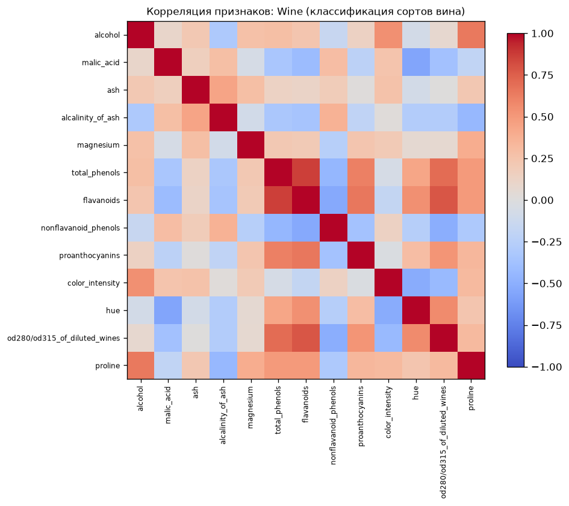

*Рисунок 5.4 — корреляция признаков*

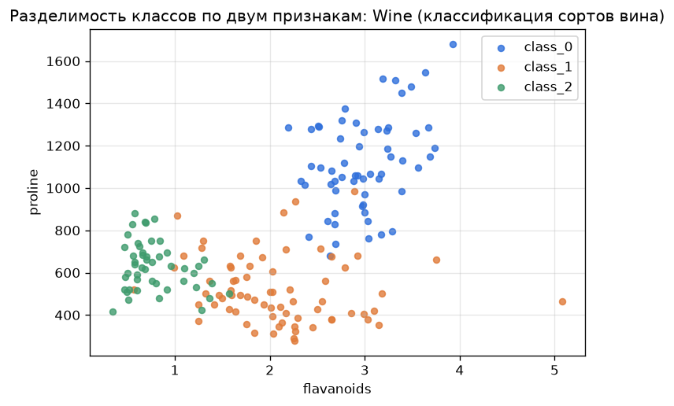

*Рисунок 5.5 — разделимость классов по двум лучшим признакам*

### 5.2. Правила, сформулированные вручную

```text
1. ЕСЛИ flavanoids > 2 AND proline > 755 ТО class_0   # много флавоноидов и высокое содержание пролина
2. ЕСЛИ flavanoids < 1.6 AND color_intensity > 3.8 ТО class_2   # мало флавоноидов при насыщенном цвете
3. ИНАЧЕ ТО class_1
```

Покрытие и точность каждого правила:

| rule | predicted_class | covered | correct | rule_precision |
|---|---|---|---|---|
| ЕСЛИ flavanoids > 2 AND proline > 755 ТО class_0 | class_0 | 60 | 57 | 0.95 |
| ЕСЛИ flavanoids < 1.6 AND color_intensity > 3.8 ТО class_2 | class_2 | 50 | 48 | 0.96 |
| ИНАЧЕ (правило по умолчанию) ТО class_1 | class_1 | 68 | 66 | 0.9706 |

Точность набора правил: **0.9607** на всех 178 объектах и **1.0000** на тестовой выборке. Прогноз сохранён в файл `code/results/wine/10_predictions_manual_rules.csv` (строка = объект, столбцы = признаки, истинный класс, предсказанный класс, признак совпадения).

### 5.3. Дерево решений

| max_depth | train_accuracy | test_accuracy | train_precision_macro | test_precision_macro | real_depth | leaves | nodes | fit_seconds | peak_memory_kb |
|---|---|---|---|---|---|---|---|---|---|
| 3 | 0.9919 | 0.963 | 0.9935 | 0.971 | 3 | 7 | 13 | 0.00258 | 26.52 |
| 5 | 1.0 | 0.963 | 1.0 | 0.971 | 4 | 8 | 15 | 0.002722 | 26.5 |
| 7 | 1.0 | 0.963 | 1.0 | 0.971 | 4 | 8 | 15 | 0.002303 | 26.44 |
| 10 | 1.0 | 0.963 | 1.0 | 0.971 | 4 | 8 | 15 | 0.002404 | 26.49 |
| без ограничения | 1.0 | 0.963 | 1.0 | 0.971 | 4 | 8 | 15 | 0.002505 | 26.57 |

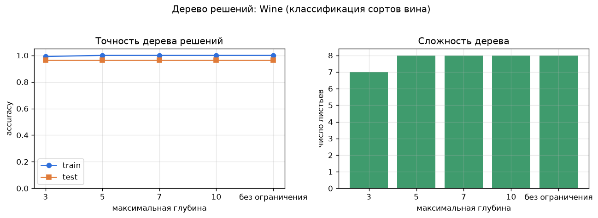

*Рисунок 5.6 — точность и сложность дерева в зависимости от глубины*

Правила лучшего дерева (глубина 3):

```text
|--- color_intensity <= 3.82
|   |--- ash <= 3.00
|   |   |--- od280/od315_of_diluted_wines <= 3.73
|   |   |   |--- class: class_1
|   |   |--- od280/od315_of_diluted_wines >  3.73
|   |   |   |--- class: class_0
|   |--- ash >  3.00
|   |   |--- class: class_0
|--- color_intensity >  3.82
|   |--- flavanoids <= 1.58
|   |   |--- alcalinity_of_ash <= 17.65
|   |   |   |--- class: class_1
|   |   |--- alcalinity_of_ash >  17.65
|   |   |   |--- class: class_2
|   |--- flavanoids >  1.58
|   |   |--- proline <= 724.50
|   |   |   |--- class: class_1
|   |   |--- proline >  724.50
|   |   |   |--- class: class_0
```

### 5.4. Линейная и softmax-регрессия: влияние числа итераций

| model | n_iterations | train_loss | train_accuracy | test_accuracy | test_precision_macro | weight_norm_l2 | weight_update_norm_l2 |
|---|---|---|---|---|---|---|---|
| Линейная регрессия (MSE) | 10 | 0.1026 | 0.9839 | 0.963 | 0.9616 | 0.6939 | 0.0186 |
| Линейная регрессия (MSE) | 20 | 0.0938 | 0.9919 | 0.963 | 0.9616 | 0.7546 | 0.0058 |
| Линейная регрессия (MSE) | 30 | 0.0916 | 0.9919 | 0.9815 | 0.9825 | 0.7707 | 0.0041 |
| Линейная регрессия (MSE) | 40 | 0.0903 | 0.9919 | 0.9815 | 0.9825 | 0.7807 | 0.0032 |
| Линейная регрессия (MSE) | 50 | 0.0895 | 0.9919 | 0.9815 | 0.9825 | 0.7889 | 0.0026 |
| Линейная регрессия (MSE) | 60 | 0.089 | 0.9919 | 0.9815 | 0.9825 | 0.796 | 0.0021 |
| Линейная регрессия (MSE) | 70 | 0.0887 | 1.0 | 0.9815 | 0.9825 | 0.8021 | 0.0017 |
| Линейная регрессия (MSE) | 80 | 0.0884 | 1.0 | 0.9815 | 0.9825 | 0.8073 | 0.0014 |
| Линейная регрессия (MSE) | 90 | 0.0883 | 1.0 | 0.9815 | 0.9825 | 0.8118 | 0.0012 |
| Линейная регрессия (MSE) | 100 | 0.0881 | 1.0 | 0.9815 | 0.9825 | 0.8155 | 0.001 |
| Softmax-регрессия (log-loss) | 10 | 0.1277 | 0.9839 | 0.963 | 0.9608 | 1.801 | 0.0664 |
| Softmax-регрессия (log-loss) | 20 | 0.0833 | 0.9919 | 0.9815 | 0.9792 | 2.2508 | 0.0372 |
| Softmax-регрессия (log-loss) | 30 | 0.0644 | 0.9919 | 0.9815 | 0.9792 | 2.5441 | 0.0269 |
| Softmax-регрессия (log-loss) | 40 | 0.0532 | 0.9919 | 0.9815 | 0.9792 | 2.7681 | 0.0214 |
| Softmax-регрессия (log-loss) | 50 | 0.0457 | 0.9919 | 0.9815 | 0.9792 | 2.9518 | 0.018 |
| Softmax-регрессия (log-loss) | 60 | 0.0403 | 0.9919 | 0.9815 | 0.9792 | 3.1088 | 0.0156 |
| Softmax-регрессия (log-loss) | 70 | 0.0361 | 1.0 | 0.9815 | 0.9792 | 3.2465 | 0.0138 |
| Softmax-регрессия (log-loss) | 80 | 0.0327 | 1.0 | 0.9815 | 0.9792 | 3.3694 | 0.0124 |
| Softmax-регрессия (log-loss) | 90 | 0.03 | 1.0 | 0.9815 | 0.9792 | 3.4807 | 0.0112 |
| Softmax-регрессия (log-loss) | 100 | 0.0277 | 1.0 | 0.9815 | 0.9792 | 3.5825 | 0.0103 |

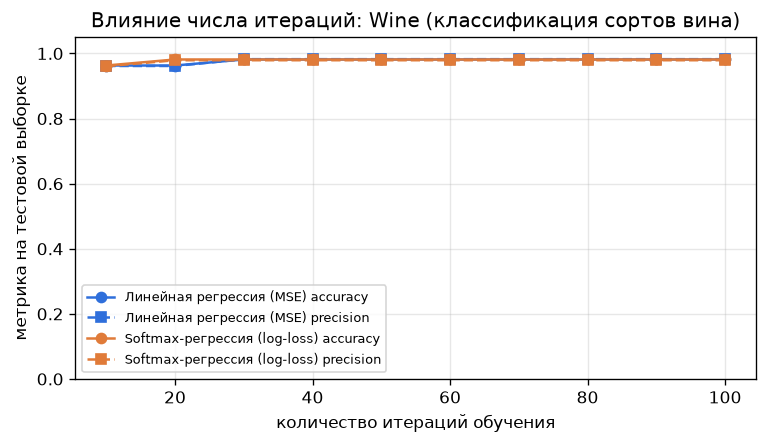

*Рисунок 5.7 — качество в зависимости от числа итераций обучения*

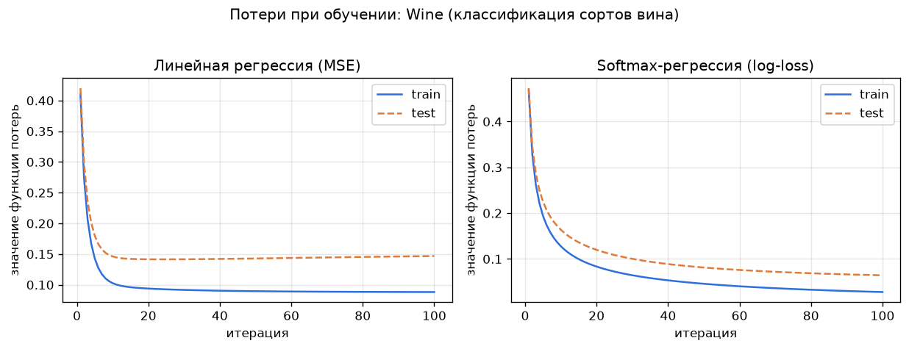

*Рисунок 5.8 — потери при обучении*

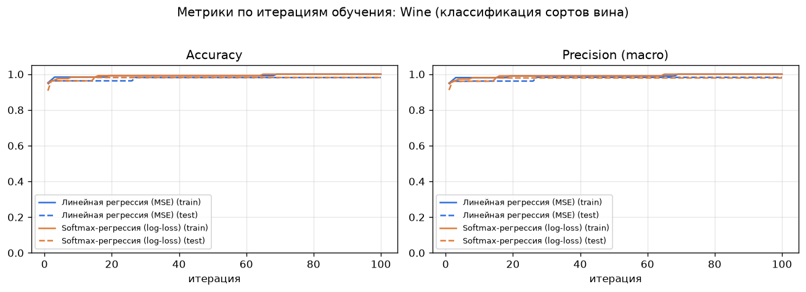

*Рисунок 5.9 — accuracy и precision по итерациям*

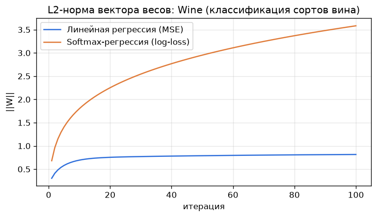

*Рисунок 5.10 — L2-норма вектора весов ‖W‖*

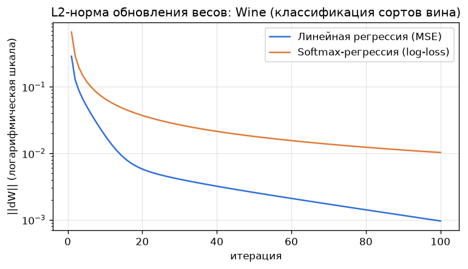

*Рисунок 5.11 — L2-норма изменения весов ‖ΔW‖ (логарифмическая шкала)*

### 5.5. Сравнение моделей

| model | params | test_accuracy | test_precision_macro | test_recall_macro | test_f1_macro | fit_time_ms | peak_memory_kb | precision_class_0 | precision_class_1 | precision_class_2 |
|---|---|---|---|---|---|---|---|---|---|---|
| Ручные правила | 3 правил | 1.0 | 1.0 | 1.0 | 1.0 | 0.0 | 12.88 | 1.0 | 1.0 | 1.0 |
| Дерево решений (глубина 3) | max_depth=3, листьев=7 | 0.963 | 0.971 | 0.9593 | 0.9651 | 2.58 | 26.52 | 1.0 | 0.913 | 1.0 |
| Линейная регрессия (MSE) | lr=0.1, iterations=100 | 0.9815 | 0.9825 | 0.9841 | 0.9833 | 70.953 | 124.57 | 0.9474 | 1.0 | 1.0 |
| Softmax-регрессия (log-loss) | lr=0.5, iterations=100 | 0.9815 | 0.9792 | 0.9841 | 0.9816 | 80.353 | 136.07 | 1.0 | 1.0 | 0.9375 |

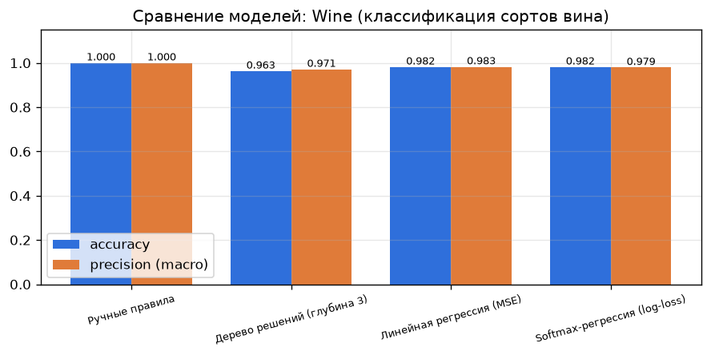

*Рисунок 5.12 — сравнение моделей*

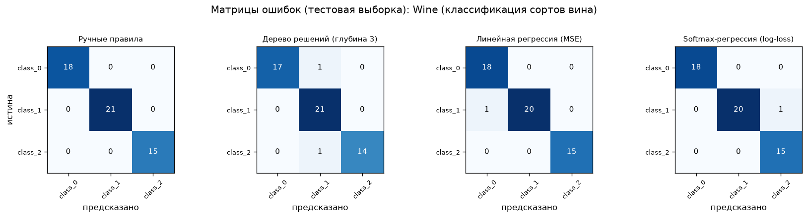

*Рисунок 5.13 — матрицы ошибок*

**Выводы по Wine (ответы на вопросы задания).**

* *Какие признаки сильнее всего коррелируют с классом?* По корреляционному
  отношению это `flavanoids` (η² = 0.7278),
  `proline` (η² = 0.7038) и
  `od280/od315_of_diluted_wines` (η² = 0.6847).
  Именно они и использованы в ручных правилах.
* *Точность ручных правил* — 0.9607 на всём датасете. Два правила по трём
  химическим показателям практически повторяют работу обученных моделей.
* *Дерево решений.* Начиная с реальной глубины 4 дерево полностью запоминает
  обучающую выборку (train accuracy 1.00), но точность на тесте при этом не
  растёт: при глубине 3 — 7 листьев и test accuracy 0.963, при глубине 5 — 8 листьев и та же test accuracy 0.963. Ограничение глубины тремя уровнями даёт то же качество
  на тесте при меньшем дереве, то есть более простую и понятную модель.
* *Что сложнее разделить — три сорта вина или три вида ирисов?* Формально Wine
  разделяется даже лучше: признаков 13 вместо 4, и линейные модели дают на нём
  более высокую точность, чем на Iris. Но достигается это за счёт размерности:
  по любой одной паре признаков классы вина перекрываются сильнее, чем ирисы,
  и обязательна стандартизация, поскольку масштабы признаков отличаются в тысячи
  раз (`proline` ≈ 750 против `hue` ≈ 0.96). Ирисы проще в том смысле, что им
  достаточно двух признаков.

\pagebreak
## 6. Задание на защиту №2: датасет Palmer Penguins

### 6.1. Анализ датасета

| параметр | значение |
|---|---|
| Название | Palmer Penguins (пингвины архипелага Палмера) |
| Источник | https://philchodrow.github.io/PIC16A/datasets/palmer_penguins.csv |
| Число объектов | 342 |
| Число признаков | 4 |
| Число классов | 3 |
| Признаки | culmen_length_mm, culmen_depth_mm, flipper_length_mm, body_mass_g |
| Классы (метки) | Adelie, Chinstrap, Gentoo |
| Пропусков в признаках | 0 |
| Тип признаков | вещественные (количественные) |
| Примечание | Обнаружены пропуски: удалено 2 строки из 344. |
| Примечание | Классы несбалансированы (~146/68/119). |

**Баланс классов.**

| class | count | share_% | imbalance_ratio_max_min |
|---|---|---|---|
| Adelie | 151 | 44.15 | 2.22 |
| Chinstrap | 68 | 19.88 | 2.22 |
| Gentoo | 123 | 35.96 | 2.22 |

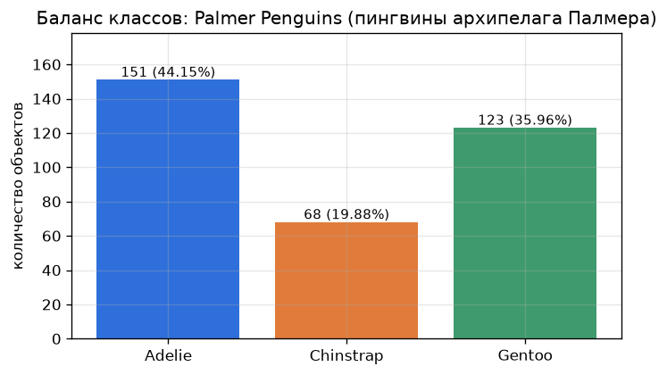

*Рисунок 6.1 — баланс классов*

**Информативность признаков.** Величина η² показывает, какая доля дисперсии признака объясняется принадлежностью к классу: чем ближе к 1, тем лучше признак разделяет классы.

| feature | eta_squared | abs_corr_with_label | min | mean | max |
|---|---|---|---|---|---|
| flipper_length_mm | 0.7782 | 0.8543 | 172.0 | 200.915 | 231.0 |
| culmen_length_mm | 0.7078 | 0.7314 | 32.1 | 43.922 | 59.6 |
| culmen_depth_mm | 0.6798 | 0.7441 | 13.1 | 17.151 | 21.5 |
| body_mass_g | 0.6697 | 0.7505 | 2700.0 | 4201.754 | 6300.0 |

Наиболее информативные признаки: **flipper_length_mm** (η² = 0.7782), **culmen_length_mm** (η² = 0.7078), **culmen_depth_mm** (η² = 0.6798).

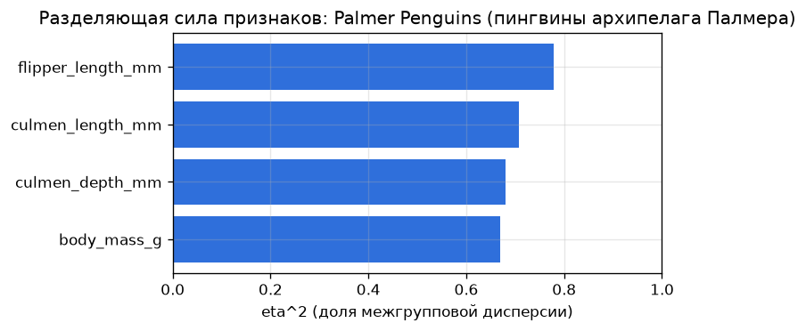

*Рисунок 6.2 — разделяющая сила признаков*

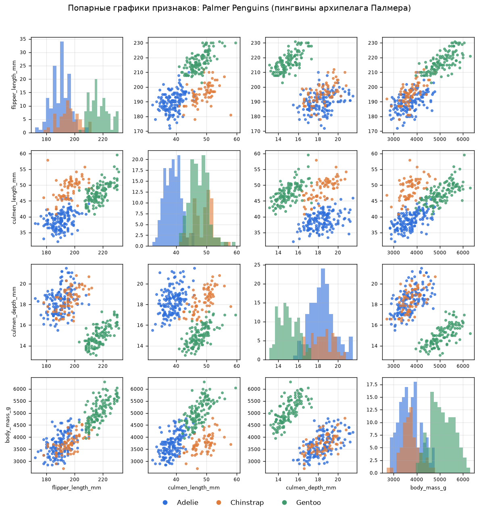

*Рисунок 6.3 — попарные графики признаков*

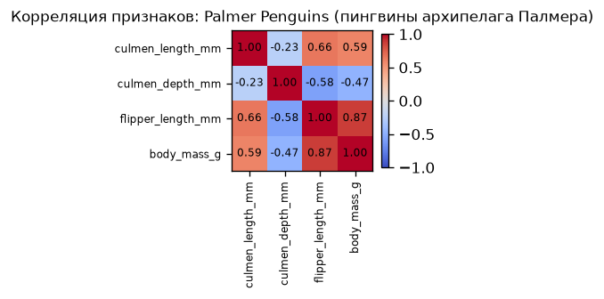

*Рисунок 6.4 — корреляция признаков*

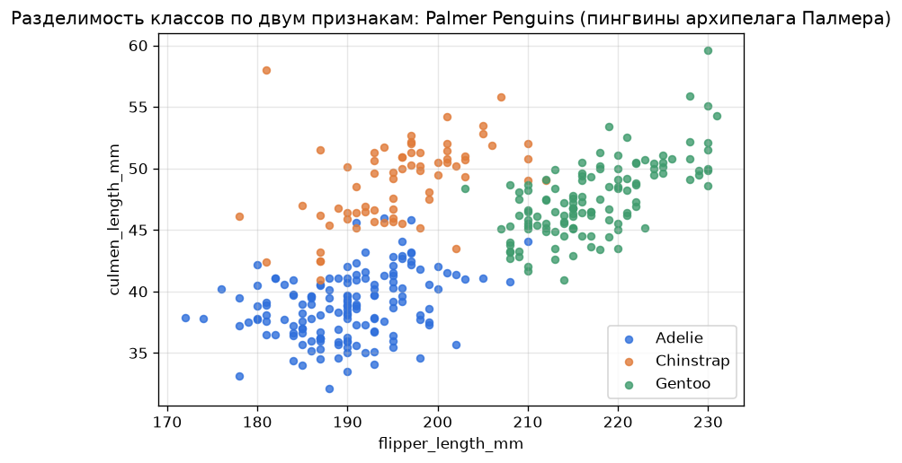

*Рисунок 6.5 — разделимость классов по двум лучшим признакам*

### 6.2. Правила, сформулированные вручную

```text
1. ЕСЛИ flipper_length_mm > 205 AND culmen_depth_mm < 17 ТО Gentoo   # длинные ласты и неглубокий клюв
2. ЕСЛИ culmen_length_mm < 43 ТО Adelie   # короткий клюв
3. ИНАЧЕ ТО Chinstrap
```

Покрытие и точность каждого правила:

| rule | predicted_class | covered | correct | rule_precision |
|---|---|---|---|---|
| ЕСЛИ flipper_length_mm > 205 AND culmen_depth_mm < 17 ТО Gentoo | Gentoo | 116 | 116 | 1.0 |
| ЕСЛИ culmen_length_mm < 43 ТО Adelie | Adelie | 147 | 143 | 0.9728 |
| ИНАЧЕ (правило по умолчанию) ТО Chinstrap | Chinstrap | 79 | 64 | 0.8101 |

Точность набора правил: **0.9444** на всех 342 объектах и **0.9417** на тестовой выборке. Прогноз сохранён в файл `code/results/penguins/10_predictions_manual_rules.csv` (строка = объект, столбцы = признаки, истинный класс, предсказанный класс, признак совпадения).

### 6.3. Дерево решений

| max_depth | train_accuracy | test_accuracy | train_precision_macro | test_precision_macro | real_depth | leaves | nodes | fit_seconds | peak_memory_kb |
|---|---|---|---|---|---|---|---|---|---|
| 3 | 0.9665 | 0.9806 | 0.9592 | 0.9767 | 3 | 7 | 13 | 0.002844 | 27.86 |
| 5 | 1.0 | 0.9903 | 1.0 | 0.9848 | 5 | 12 | 23 | 0.002528 | 27.95 |
| 7 | 1.0 | 0.9903 | 1.0 | 0.9848 | 5 | 12 | 23 | 0.00231 | 27.83 |
| 10 | 1.0 | 0.9903 | 1.0 | 0.9848 | 5 | 12 | 23 | 0.002241 | 27.72 |
| без ограничения | 1.0 | 0.9903 | 1.0 | 0.9848 | 5 | 12 | 23 | 0.002438 | 27.63 |

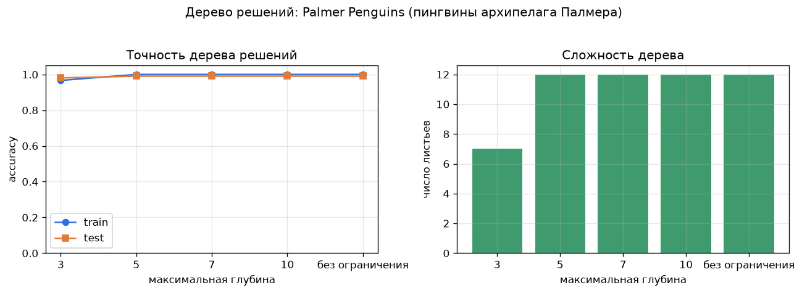

*Рисунок 6.6 — точность и сложность дерева в зависимости от глубины*

Правила лучшего дерева (глубина 5):

```text
|--- flipper_length_mm <= 206.50
|   |--- culmen_length_mm <= 43.35
|   |   |--- culmen_length_mm <= 42.30
|   |   |   |--- culmen_depth_mm <= 16.65
|   |   |   |   |--- culmen_length_mm <= 39.50
|   |   |   |   |   |--- class: Adelie
|   |   |   |   |--- culmen_length_mm >  39.50
|   |   |   |   |   |--- class: Chinstrap
|   |   |   |--- culmen_depth_mm >  16.65
|   |   |   |   |--- class: Adelie
|   |   |--- culmen_length_mm >  42.30
|   |   |   |--- flipper_length_mm <= 189.50
|   |   |   |   |--- class: Chinstrap
|   |   |   |--- flipper_length_mm >  189.50
|   |   |   |   |--- class: Adelie
|   |--- culmen_length_mm >  43.35
|   |   |--- body_mass_g <= 4175.00
|   |   |   |--- class: Chinstrap
|   |   |--- body_mass_g >  4175.00
|   |   |   |--- culmen_length_mm <= 48.80
|   |   |   |   |--- culmen_depth_mm <= 17.05
|   |   |   |   |   |--- class: Gentoo
|   |   |   |   |--- culmen_depth_mm >  17.05
|   |   |   |   |   |--- class: Adelie
|   |   |   |--- culmen_length_mm >  48.80
|   |   |   |   |--- class: Chinstrap
|--- flipper_length_mm >  206.50
|   |--- culmen_depth_mm <= 17.50
|   |   |--- class: Gentoo
|   |--- culmen_depth_mm >  17.50
|   |   |--- culmen_depth_mm <= 18.95
|   |   |   |--- class: Adelie
|   |   |--- culmen_depth_mm >  18.95
|   |   |   |--- class: Chinstrap
```

### 6.4. Линейная и softmax-регрессия: влияние числа итераций

| model | n_iterations | train_loss | train_accuracy | test_accuracy | test_precision_macro | weight_norm_l2 | weight_update_norm_l2 |
|---|---|---|---|---|---|---|---|
| Линейная регрессия (MSE) | 10 | 0.1328 | 0.9665 | 0.9126 | 0.9444 | 0.7528 | 0.0281 |
| Линейная регрессия (MSE) | 20 | 0.1069 | 0.9749 | 0.9903 | 0.9928 | 0.8697 | 0.0102 |
| Линейная регрессия (MSE) | 30 | 0.102 | 0.9749 | 0.9903 | 0.9928 | 0.9109 | 0.005 |
| Линейная регрессия (MSE) | 40 | 0.1008 | 0.9749 | 0.9903 | 0.9928 | 0.9302 | 0.0026 |
| Линейная регрессия (MSE) | 50 | 0.1004 | 0.9791 | 0.9903 | 0.9928 | 0.94 | 0.0014 |
| Линейная регрессия (MSE) | 60 | 0.1003 | 0.9791 | 0.9903 | 0.9928 | 0.9451 | 0.0009 |
| Линейная регрессия (MSE) | 70 | 0.1002 | 0.9791 | 0.9903 | 0.9928 | 0.9478 | 0.0006 |
| Линейная регрессия (MSE) | 80 | 0.1002 | 0.9791 | 0.9903 | 0.9928 | 0.9493 | 0.0004 |
| Линейная регрессия (MSE) | 90 | 0.1002 | 0.9791 | 0.9903 | 0.9928 | 0.9502 | 0.0003 |
| Линейная регрессия (MSE) | 100 | 0.1002 | 0.9791 | 0.9903 | 0.9928 | 0.9507 | 0.0002 |
| Softmax-регрессия (log-loss) | 10 | 0.2275 | 0.9623 | 0.9029 | 0.9394 | 1.8287 | 0.0836 |
| Softmax-регрессия (log-loss) | 20 | 0.1556 | 0.9749 | 0.9709 | 0.9688 | 2.3883 | 0.0475 |
| Softmax-регрессия (log-loss) | 30 | 0.1249 | 0.9791 | 0.9806 | 0.9767 | 2.7524 | 0.0342 |
| Softmax-регрессия (log-loss) | 40 | 0.107 | 0.9791 | 0.9806 | 0.9767 | 3.0285 | 0.0271 |
| Softmax-регрессия (log-loss) | 50 | 0.0951 | 0.9791 | 0.9903 | 0.9848 | 3.2541 | 0.0227 |
| Softmax-регрессия (log-loss) | 60 | 0.0864 | 0.9791 | 0.9903 | 0.9848 | 3.4466 | 0.0196 |
| Softmax-регрессия (log-loss) | 70 | 0.0797 | 0.9833 | 0.9903 | 0.9848 | 3.6154 | 0.0174 |
| Softmax-регрессия (log-loss) | 80 | 0.0743 | 0.9833 | 0.9903 | 0.9848 | 3.7665 | 0.0156 |
| Softmax-регрессия (log-loss) | 90 | 0.07 | 0.9833 | 0.9903 | 0.9848 | 3.9037 | 0.0142 |
| Softmax-регрессия (log-loss) | 100 | 0.0663 | 0.9833 | 0.9903 | 0.9848 | 4.0297 | 0.0131 |

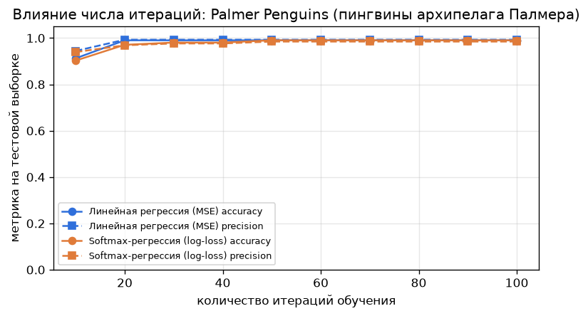

*Рисунок 6.7 — качество в зависимости от числа итераций обучения*

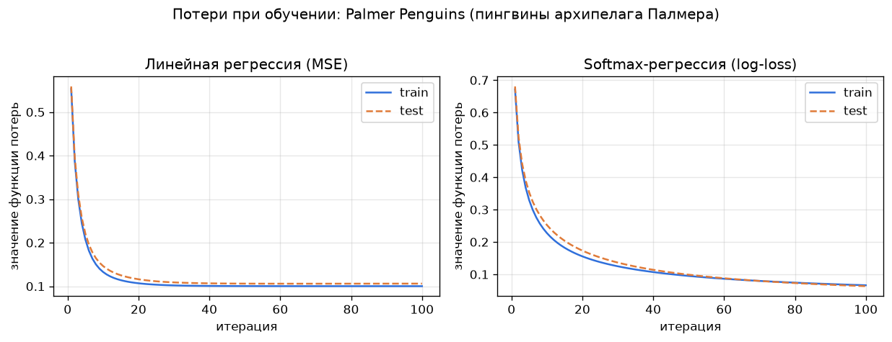

*Рисунок 6.8 — потери при обучении*

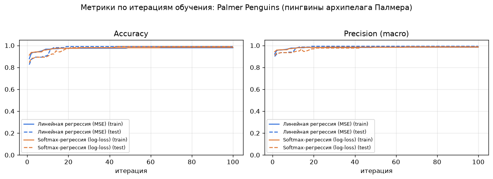

*Рисунок 6.9 — accuracy и precision по итерациям*

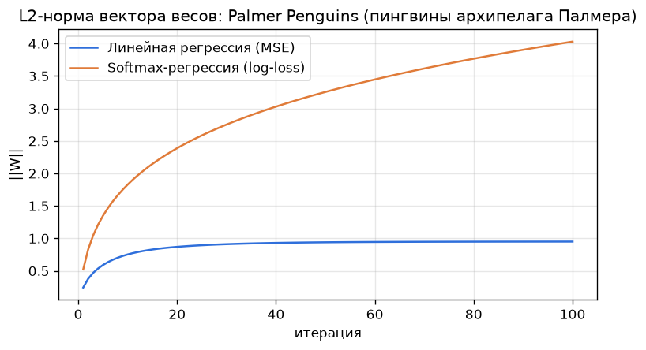

*Рисунок 6.10 — L2-норма вектора весов ‖W‖*

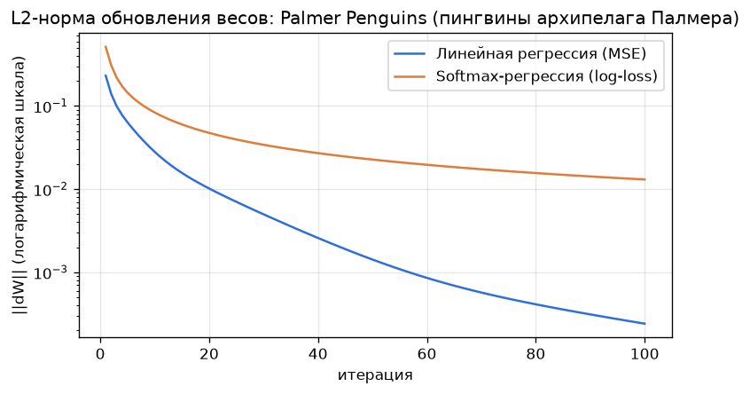

*Рисунок 6.11 — L2-норма изменения весов ‖ΔW‖ (логарифмическая шкала)*

### 6.5. Сравнение моделей

| model | params | test_accuracy | test_precision_macro | test_recall_macro | test_f1_macro | fit_time_ms | peak_memory_kb | precision_Adelie | precision_Chinstrap | precision_Gentoo |
|---|---|---|---|---|---|---|---|---|---|---|
| Ручные правила | 3 правил | 0.9417 | 0.9259 | 0.9491 | 0.9374 | 0.0 | 24.12 | 1.0 | 0.7778 | 1.0 |
| Дерево решений (глубина 5) | max_depth=5, листьев=12 | 0.9903 | 0.9848 | 0.9926 | 0.9887 | 2.528 | 27.95 | 1.0 | 0.9545 | 1.0 |
| Линейная регрессия (MSE) | lr=0.1, iterations=100 | 0.9903 | 0.9928 | 0.9841 | 0.9884 | 117.868 | 134.74 | 0.9783 | 1.0 | 1.0 |
| Softmax-регрессия (log-loss) | lr=0.5, iterations=100 | 0.9903 | 0.9848 | 0.9926 | 0.9887 | 126.986 | 155.18 | 1.0 | 0.9545 | 1.0 |

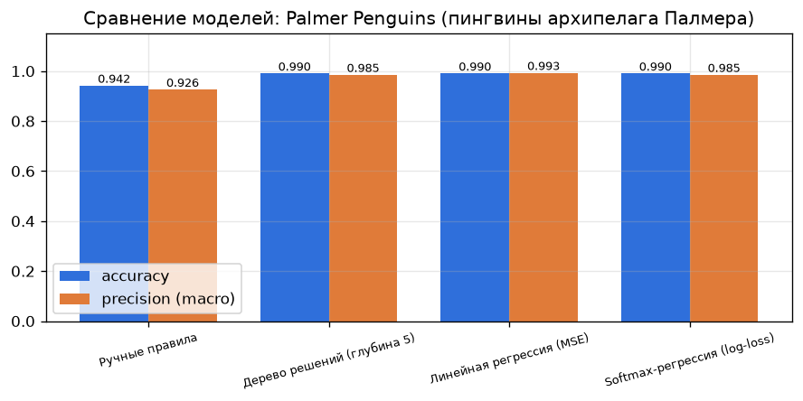

*Рисунок 6.12 — сравнение моделей*

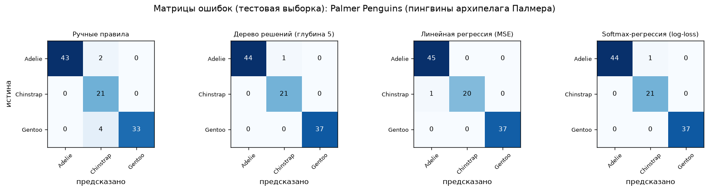

*Рисунок 6.13 — матрицы ошибок*

**Выводы по Palmer Penguins (ответы на вопросы задания).**

* *Пропуски.* Обнаружены пропуски: удалено 2 строки из 344. Пропуски обнаружены в измерениях клюва, ласт и массы тела;
  строки с пропусками удалены, так как их доля мала (менее 1 %), а заполнение
  средним исказило бы границы между видами.
* *Какие признаки лучше разделяют виды?* `flipper_length_mm` и
  `culmen_length_mm`: по длине ласт однозначно выделяется Gentoo, а по длине
  клюва — Adelie. Chinstrap занимает промежуточное положение и потому
  распознаётся хуже всех.
* *Точность ручных правил* — 0.9444. Слабое место — правило по умолчанию
  «ИНАЧЕ (правило по умолчанию) ТО Chinstrap» с точностью 0.8101: в остаток после первых
  двух правил попадают не только Chinstrap, но и пингвины других видов с
  промежуточными размерами клюва и ласт.
* *Чем датасет сложнее Iris?* Объектов вдвое больше, есть пропуски, классы
  несбалансированы (Chinstrap — всего ≈20 % выборки), признаки измерены в разных
  единицах (миллиметры и граммы), а границы классов не сводятся к одному
  признаку: нужны минимум два измерения клюва плюс длина ласт.

\pagebreak
## 7. Результаты тестирования: время и память

Время измерено монотонным таймером `time.perf_counter`, пиковое потребление памяти — стандартным модулем `tracemalloc` (учитываются только выделения Python). Замеры выполнены на процессоре x86-64 под Windows 11, Python 3.14, и сохраняются при каждом запуске в `code/results/<датасет>/50_benchmark.csv`.

### 7.1. Iris (ирисы Фишера) — основное задание

| Этап | Время, мс | Пиковая память, КБ | Примечание |
|---|---|---|---|
| Анализ датасета | 15.865 | 66.54 | 150 объектов |
| Прогноз по ручным правилам | 0.38 | 11.24 | 3 правил |
| Обучение дерева (глубина 3) | 2.5 | 28.34 | листьев: 5 |
| Обучение дерева (глубина 5) | 1.941 | 20.98 | листьев: 8 |
| Обучение дерева (глубина 7) | 2.163 | 21.08 | листьев: 8 |
| Обучение дерева (глубина 10) | 2.275 | 21.08 | листьев: 8 |
| Обучение дерева (глубина без ограничения) | 2.16 | 21.23 | листьев: 8 |
| Обучение: Линейная регрессия (MSE) | 60.139 | 112.75 | 100 итераций, lr=0.1 |
| Обучение: Softmax-регрессия (log-loss) | 68.076 | 122.67 | 100 итераций, lr=0.5 |

### 7.2. Wine (сорта вина) — задание на защиту №1

| Этап | Время, мс | Пиковая память, КБ | Примечание |
|---|---|---|---|
| Анализ датасета | 30.408 | 83.85 | 178 объектов |
| Прогноз по ручным правилам | 0.587 | 12.88 | 3 правил |
| Обучение дерева (глубина 3) | 2.58 | 26.52 | листьев: 7 |
| Обучение дерева (глубина 5) | 2.722 | 26.5 | листьев: 8 |
| Обучение дерева (глубина 7) | 2.303 | 26.44 | листьев: 8 |
| Обучение дерева (глубина 10) | 2.404 | 26.49 | листьев: 8 |
| Обучение дерева (глубина без ограничения) | 2.505 | 26.57 | листьев: 8 |
| Обучение: Линейная регрессия (MSE) | 70.953 | 124.57 | 100 итераций, lr=0.1 |
| Обучение: Softmax-регрессия (log-loss) | 80.353 | 136.07 | 100 итераций, lr=0.5 |

### 7.3. Palmer Penguins (пингвины) — задание на защиту №2

| Этап | Время, мс | Пиковая память, КБ | Примечание |
|---|---|---|---|
| Анализ датасета | 13.286 | 52.26 | 342 объектов |
| Прогноз по ручным правилам | 0.814 | 24.12 | 3 правил |
| Обучение дерева (глубина 3) | 2.844 | 27.86 | листьев: 7 |
| Обучение дерева (глубина 5) | 2.528 | 27.95 | листьев: 12 |
| Обучение дерева (глубина 7) | 2.31 | 27.83 | листьев: 12 |
| Обучение дерева (глубина 10) | 2.241 | 27.72 | листьев: 12 |
| Обучение дерева (глубина без ограничения) | 2.438 | 27.63 | листьев: 12 |
| Обучение: Линейная регрессия (MSE) | 117.868 | 134.74 | 100 итераций, lr=0.1 |
| Обучение: Softmax-регрессия (log-loss) | 126.986 | 155.18 | 100 итераций, lr=0.5 |

### 7.4. Анализ замеров

* Классификация по правилам не требует обучения вообще и выполняется за 0.380 мс — это применение 3 правил (включая правило по умолчанию) ко всему датасету через булевы маски NumPy.
* Обучение дерева решений занимает в среднем 2.21 мс и почти не зависит от заданной глубины: реальная глубина ограничена самой выборкой, а сложность O(n·m·log n) определяется сортировкой значений признаков.
* Обучение линейных моделей на 100 итерациях — в среднем 64.1 мс, то есть примерно в 29 раз дольше дерева. Время растёт линейно по числу итераций, что видно в таблицах `30_linear_iterations_comparison.csv`.
* Потребление памяти во всех случаях измеряется десятками-сотнями килобайт: данные помещаются в кэш процессора, поэтому узким местом является не память, а число арифметических операций.

### 7.5. Модульные тесты

Работоспособность проверена на различных наборах входных данных автоматическими тестами (`code/tests/test_lab1.py`, 36 тестов, `python -m unittest discover -s tests`):

* три реальных датасета (Iris, Wine, Penguins) и синтетический набор из трёх гауссовых облаков;
* вырожденные случаи: выборка из одного класса, выборка из двух объектов, постоянный признак (деление на нулевое СКО), пустой вектор меток, класс, который модель ни разу не предсказала;
* сверка собственных метрик (accuracy, precision, матрица ошибок) с `scikit-learn`;
* проверка сходимости: функция потерь убывает, ‖ΔW‖ уменьшается, результат воспроизводим при одинаковом `random_state`;
* сквозной прогон всего конвейера с проверкой, что созданы все CSV-файлы и графики.

\pagebreak
## 8. Выводы

| Датасет | Модель | Accuracy (test) | Precision (macro) | Время обучения, мс |
|---|---|---|---|---|
| iris | Ручные правила | 0.9556 | 0.9556 | 0.0 |
| iris | Дерево решений (глубина 3) | 0.9778 | 0.9792 | 2.5 |
| iris | Линейная регрессия (MSE) | 0.8 | 0.8056 | 60.139 |
| iris | Softmax-регрессия (log-loss) | 0.8667 | 0.8667 | 68.076 |
| wine | Ручные правила | 1.0 | 1.0 | 0.0 |
| wine | Дерево решений (глубина 3) | 0.963 | 0.971 | 2.58 |
| wine | Линейная регрессия (MSE) | 0.9815 | 0.9825 | 70.953 |
| wine | Softmax-регрессия (log-loss) | 0.9815 | 0.9792 | 80.353 |
| penguins | Ручные правила | 0.9417 | 0.9259 | 0.0 |
| penguins | Дерево решений (глубина 5) | 0.9903 | 0.9848 | 2.528 |
| penguins | Линейная регрессия (MSE) | 0.9903 | 0.9928 | 117.868 |
| penguins | Softmax-регрессия (log-loss) | 0.9903 | 0.9848 | 126.986 |

1. **Задание выполнено полностью:** проведён анализ трёх датасетов, вручную
   сформулированы правила и автоматизированно применены к данным, обучены дерево
   решений (глубины 3, 5, 7, 10 и без ограничения) и две линейные модели с
   перебором числа итераций 10…100; все прогнозы сохранены в CSV, построены
   графики потерь, accuracy/precision, ‖W‖ и ‖ΔW‖.

2. **Ручные правила — сильный базовый метод.** На хорошо разделимых данных 2–3
   правила по важнейшим признакам дают точность, сравнимую с обученными
   моделями, при нулевом времени обучения. Их недостаток — пороги приходится
   подбирать человеку, и они не переносятся на другие данные.

3. **Дерево решений оказалось самым удобным методом** для этих задач: оно не
   требует стандартизации признаков, обучается за миллисекунды и выдаёт готовые
   правила, которые можно прочитать. Ограничение глубины — главный инструмент
   борьбы с переобучением: на Iris дерево глубины 3 работает на тесте лучше,
   чем дерево без ограничений, хотя на обучающей выборке хуже.

4. **Линейные модели требуют аккуратной настройки.** Без стандартизации
   признаков градиентный спуск на Wine расходится. Функция потерь MSE проигрывает
   перекрёстной энтропии: линейная регрессия на one-hot метках систематически
   уступает softmax-регрессии, потому что штрафует и правильные, но «слишком
   уверенные» ответы.

5. **Графики сходимости говорят о состоянии обучения больше, чем одна метрика.**
   Убывающая функция потерь показывает, что модель учится; стабилизация ‖W‖ —
   что веса перестали расти; стремление ‖ΔW‖ к нулю — что модель сошлась и
   дальнейшие итерации бессмысленны (критерий для early stopping). На Iris за
   100 итераций ‖ΔW‖ ещё не достигла нуля, то есть модель недоучена, и это
   объясняет её отставание от дерева.

6. **Интерпретируемость и точность — разные свойства.** Самая интерпретируемая
   модель (правила и дерево) здесь оказалась и самой точной, но это особенность
   хорошо разделимых табличных данных небольшого размера; на данных высокой
   размерности выбор обычно противоположный.

7. **Сложность алгоритмов подтверждается замерами:** классификация по правилам —
   O(r·c) без обучения, дерево — O(n·m·log n) на обучение и O(h) на предсказание,
   градиентный спуск — O(iterations·n·m·k), и именно он оказался самым медленным
   из трёх подходов.

\pagebreak

## 9. Приложение: ответы на контрольные вопросы

**Чем алгоритм отличается от программы?** Алгоритм — это конечная
последовательность однозначных действий, решающая задачу; программа — запись
алгоритма на конкретном языке для конкретного исполнителя. Один алгоритм можно
реализовать множеством программ.

**Свойства классического алгоритма и их аналоги в ML.** Дискретность →
итеративность; конечность → сходимость (качество растёт с числом итераций, но
точного «конца» может не быть); детерминированность → вероятностность;
результативность → приближение к оптимуму; массовость → обобщающая способность
и масштабируемость; понятность → интерпретируемость.

**Что такое сходимость ML-алгоритма?** Приближение к оптимуму по мере роста
числа итераций. В работе она видна по трём графикам: убывающий loss,
стабилизирующаяся ‖W‖, стремящаяся к нулю ‖ΔW‖.

**Что такое early stopping?** Остановка обучения до формального достижения
минимума — когда качество на отложенной выборке перестаёт расти. Практический
критерий — ‖ΔW‖ меньше заданного порога.

**Что такое переобучение?** Модель запоминает шум обучающей выборки вместо
закономерности; train accuracy растёт, test accuracy падает. В работе это видно
на деревьях глубины 5 и больше для Iris.

**Как хранится массив и связанный список?** Массив — непрерывный блок памяти,
адрес элемента вычисляется как `начало + индекс · размер`, доступ за O(1).
Связанный список — узлы с указателями, доступ по индексу за O(n).

**Почему в ML используют NumPy, а не списки Python?** Массив NumPy хранит
однотипные значения в непрерывной памяти, операции векторизованы и выполняются
в скомпилированном коде; список Python хранит указатели на объекты, что дороже
и по памяти, и по времени.

**Какая структура данных использована для истории обучения?** Список словарей
(`list[dict]`), по одной записи на итерацию, с последующим преобразованием в
`pandas.DataFrame` — добавление в конец списка стоит O(1).

**Что такое АТД и чем он отличается от структуры данных?** АТД описывает
поведение (какие операции допустимы), структура данных — реализацию (как именно
всё хранится). Пример из работы: `Dataset` как АТД «размеченная выборка» поверх
`DataFrame`.

**Как стек, очередь и дек применяются в ML?** Стек — хранение промежуточных
значений при обратном распространении ошибки; очередь — загрузка батчей
(DataLoader) и replay buffer в обучении с подкреплением; дек — скользящее окно
по временному ряду.

**Сложность бинарного поиска и почему он неэффективен в связанном списке.**
O(log n) при условии отсортированности массива, так как работает стратегия
деления пополам. В связанном списке переход к среднему элементу стоит O(n),
поэтому суммарно получается O(n log n) — хуже обычного линейного поиска.

**Сложность поиска максимума.** В упорядоченном массиве — O(1) (первый или
последний элемент), в неупорядоченном — O(n).

**Что такое loss-функция и зачем её график?** Мера расхождения предсказаний с
истиной. График показывает, идёт ли обучение: если loss не убывает, модель не
учится (слишком малый шаг, ошибка в градиенте или неподходящие признаки).

**Что такое accuracy и precision?** Accuracy — доля верных ответов по всем
классам. Precision класса — какая доля объектов, отнесённых моделью к этому
классу, действительно ему принадлежит. Precision для *setosa* равна 1.00: модель
ни разу не назвала *setosa* объект другого вида.

**Что показывают ‖W‖ и ‖ΔW‖?** ‖W‖ — «размер» модели: стабилизация означает
завершение обучения, резкий рост — расходимость. ‖ΔW‖ — скорость движения в
пространстве параметров: стремление к нулю означает сходимость.

**Какая модель интерпретируемее и почему?** Дерево решений: путь от корня к
листу читается как готовое правило «ЕСЛИ … И … ТО класс». У линейной модели
интерпретируются лишь веса, и то только после стандартизации признаков.

**В каких задачах важнее интерпретируемость, а в каких точность?**
Интерпретируемость — в медицине, кредитном скоринге, юриспруденции, где решение
нужно обосновать; точность — в распознавании образов, речи, машинном переводе.
